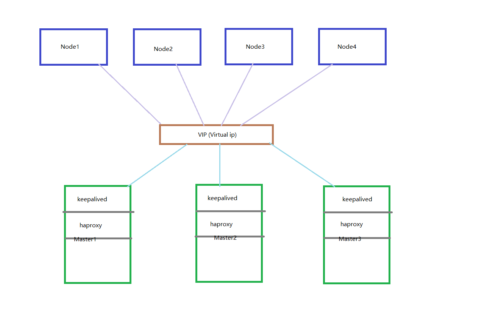

## Setup High Available Kubernetes Cluster Using Kubeadm

Kubeadm is a tool which can help to build Kubernetes clusters. It facilitates the setup processes by the two command:

kube init: used to create a master node.

kube join: add a node(master node or worker node) to current cluster. 

Before I build my cluster, I prepared 7 virtual machines with CentOS 7 installed (CentOS 8 is no longer be maintained and CentOS is considered more stable than Ubuntu). I used 3 vm for master nodes and 4 vm for worker nodes.

The final goal of our setup is like the following picture:

